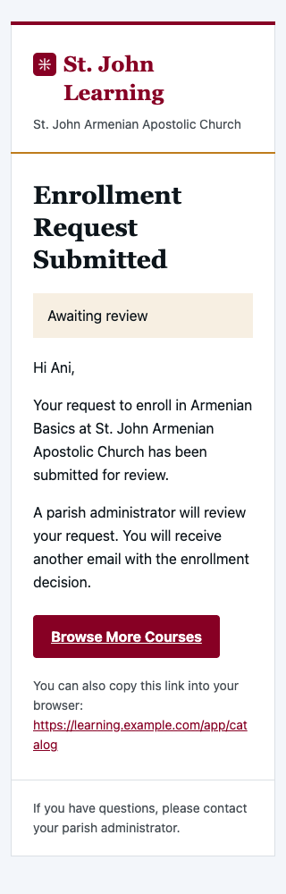
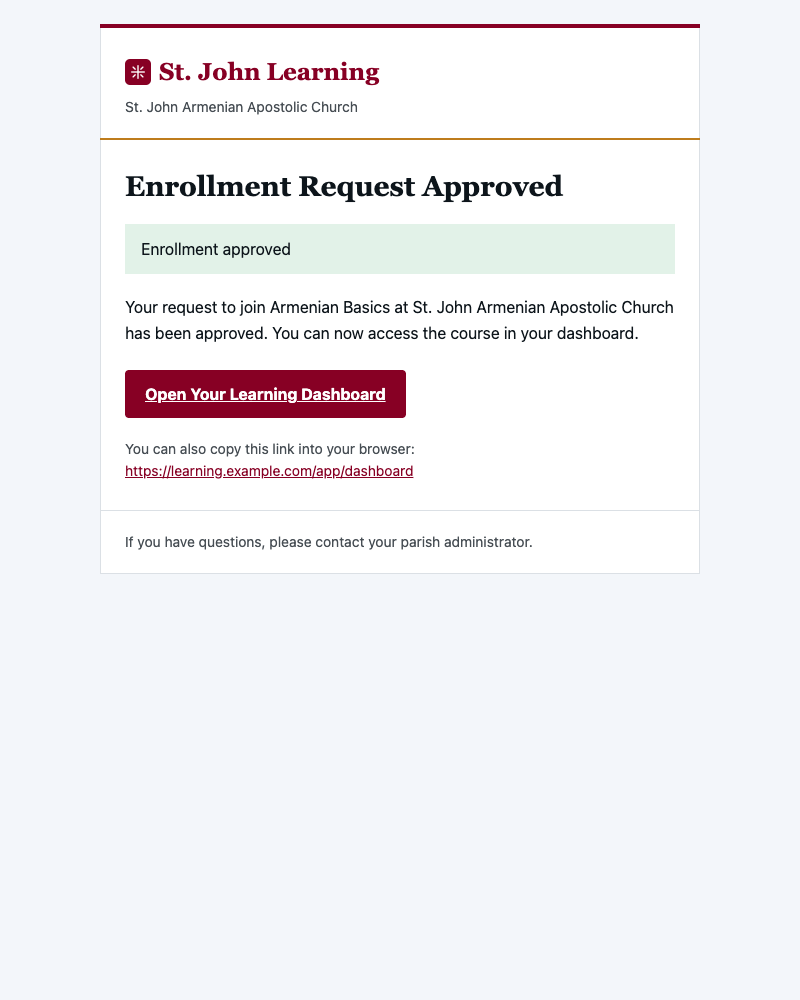
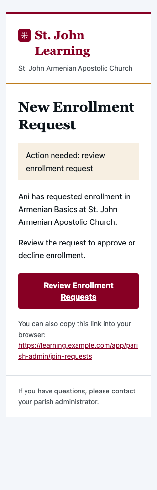

# St. John transactional email validation

The six transactional types use shared St. John Learning content, an inline table-based React layout, and explicit plaintext. The five existing subjects and triggers are unchanged; the sixth alerts current parish administrators when a new enrollment request is created. `@react-email/render` renders the standalone HTML document from Next.js server code; no email assets or webfonts are fetched during rendering.

Validation on 2026-09-08:

- Focused email, parish communication, creation repository, onboarding, and student API tests: 131 passed.
- Full Vitest suite: 110 files, 594 tests passed.
- Coverage: statements 78.82%, branches 66.87%, functions 75.00%, lines 81.57%. The checked-in thresholds (78/66/73/80) pass and were not modified. They differ from the repository guideline targets (85/70/80/85); this change does not resolve that existing discrepancy.
- Typecheck passed. Lint passed with nine existing warnings outside the email changes.
- Production build passed using Next's `@next/env` loader to read the existing local configuration without copying or printing secrets. Network access was needed for the app's existing Google Fonts.
- Playwright smoke suite: both tests passed using installed Chrome and local Clerk configuration. Resend credentials were removed from the test process and parish delivery disabled.
- Headless Chrome verified 48 cases: all six rendered emails at 320px and 800px, normal and long unbroken names/titles, and images loaded or blocked, without horizontal overflow. The decorative mark loads at its native 104px resolution and displays at 26px; adjacent product text remains readable when images are blocked. Representative screenshots are below. Browser previews do not establish exact rendering in every Outlook/Gmail/Apple Mail version; no live emails were sent.

The masthead now shares the exact navigation product mark as a 2,054-byte, 104×104 PNG. Its absolute HTTPS URL uses only the validated app origin, and its empty alt text avoids repeating the adjacent product name. No inline SVG or image dependency was introduced into plaintext.

Reproduce the asset with `node scripts/generate-email-mark.mjs` and the browser checks with `node --import tsx scripts/preview-transactional-emails.ts` (installed Chrome required). All twelve refreshed screenshots and six HTML previews are available in `/private/tmp/st-john-email-previews` for parent review; the script intercepts image requests to serve the local asset and aborts all other remote requests. The three representative screenshots below are committed. The admin-request follow-up regenerates the full preview set and adds a representative admin-request mobile screenshot.

Outlook width regression: rendered-markup tests cover all six types, asserting the unique card target, responsive width, and the fixed 600px rule inside an MSO conditional comment in the document head. Six additional Chrome checks activate that rule and remove `max-width`, confirming a 600px card in a 1200px reading pane. These check fallback geometry, not native Word/Outlook rendering. The raw head markup is static; all message fields remain React-rendered and escaped.

Regression review: dynamic fields remain React-escaped; URL construction rejects non-HTTP(S) schemes and credentials. Tests assert every subject, preheader, heading, CTA destination, meaningful text, presentation-table semantics, brand colors, AA contrast and absence of generic purple. The provider adds only explicitly supplied HTML, preserving required literal text, deterministic recipient order, retry keys, provider-message IDs and error behavior. Admin bulk bodies are never interpreted as HTML.

## Enrollment request creation inventory

- `src/app/app/onboarding/page.tsx`: `completeOnboarding` → `tryCreateJoinRequest` → `createJoinRequest`. The existing student confirmation remains separate. Onboarding may treat an existing pending request/enrollment as successful navigation, but it does not trigger another admin notification.
- `src/app/api/student/course-join-requests/route.ts`: `POST` → `createJoinRequest`, using the authenticated parish and student identity.
- `src/lib/repositories/course-join-requests.ts`: the only application insertion into `course_join_requests`. The notification runs once after a successful insert, using the returned request identity. Read, approve, reject, duplicate, and failed-insert paths do not trigger it.

Active access follows the authoritative schema: membership presence plus `role = parish_admin`; revocation deletes the row, and neither memberships nor profiles has an active/status column. Tests exclude other parishes, students, instructors, and a profile whose membership was revoked. They also cover duplicate account/mailbox rows, missing/blank emails, lookup errors, disabled delivery, partial provider failure, and safe failure isolation at creation.

One notification invocation per inserted request uses `join-request/<request-id>/admin-request` as the provider key. The existing provider still sorts recipients, hashes each batch's recipient set, and sends separate messages without exposing the recipient list. This is a best-effort post-insert notification, not a durable outbox or a guarantee of inbox delivery after a process crash. There is no automatic retry on notification failure. Existing provider ordering, batch limits, idempotency handling, and literal bulk bodies are unchanged.
